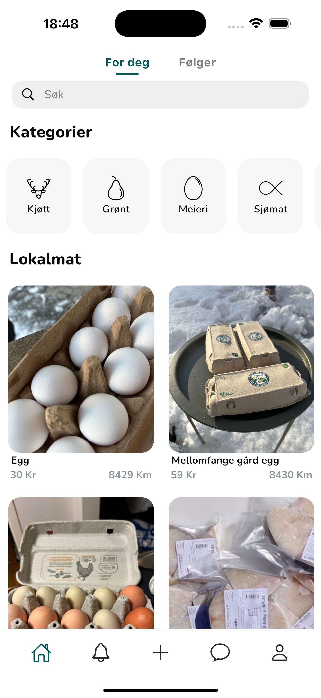

# 🌐 Matsalg: A Food marketplace app

> **Note:** This README covers the overview of the project, for more technical details feel free to contact me.

---

## 📱 Demo & Screenshots

### App Demo

<em>Short animated demo showing the main app flow.</em>

### Screenshots
<table>
  <tr>
    <td align="center">
       
      <em>Main feed displaying posts</em>
    </td>
    <td align="center">
       
      <em>Messaging/chat interface</em>
    </td>
  </tr>
  <tr>
    <td align="center">
       
      <em>Live on Apple App Store</em>
    </td>
    <td align="center">
       
      <em>Live on Google Play Store</em>
    </td>
  </tr>
</table>

*(Note: Screenshots are stored in the `/readme_assets/` directory)* 

--- 

## ✨ Overview

Matsalg is a fully functional cross-platform social photo-sharing app inspired by Instagram and Tise. Born as a high school semester project, I developed both the frontend using **Flutter** and backend knowledge for implementation consideration. After its initial release, the app became live on both **App Store** and **Google Play**, accumulating ~1600 real users.

This project demonstrates a comprehensive approach to mobile development, encompassing:

- User profiles & authentication
- Media upload with captioning functionality 
- Real-time post feed from followed users
- Engagement features: likes, comments, and posting to the 'Explore' section 
- Cross-platform deployment

Key technical focus was on implementing a robust user interface with responsive state management, ensuring smooth performance for both iOS and Android users.

 The frontend implementation showcases essential principles including proper state management, secure API communication handling (in principle), and deployment readiness.

---
